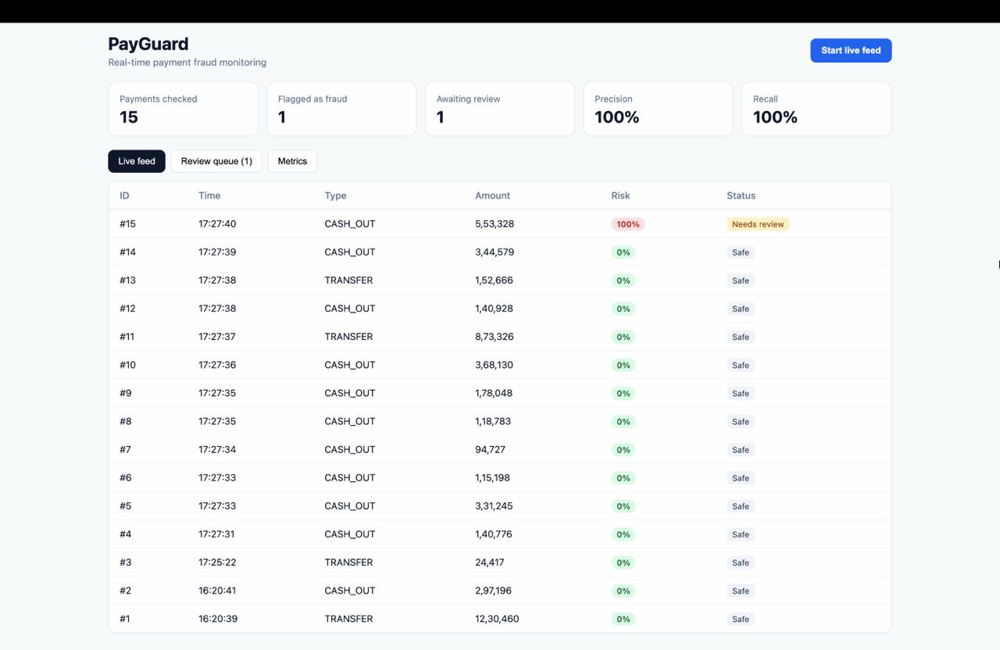
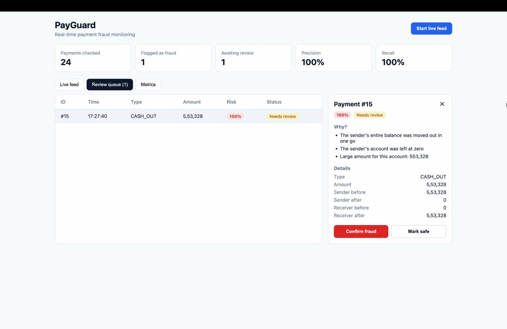
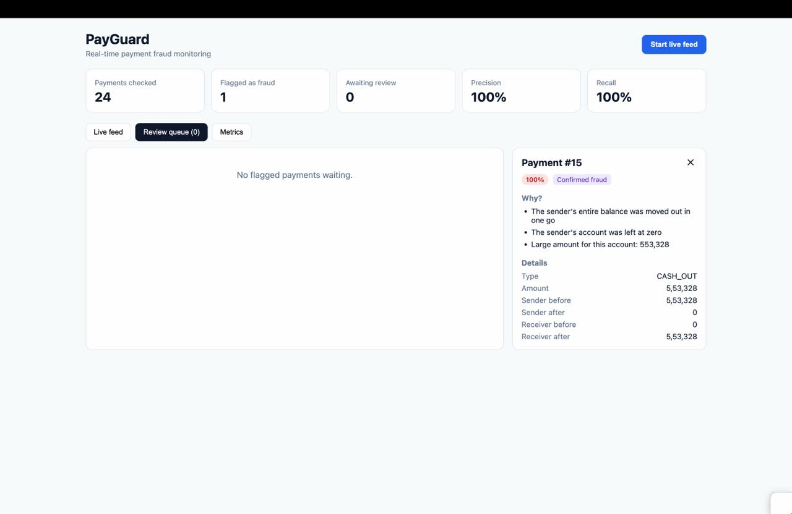
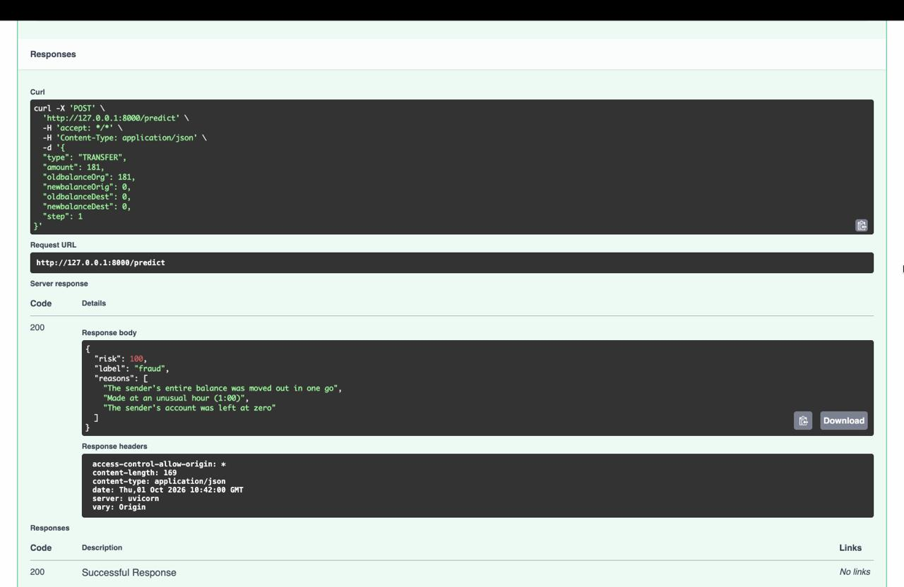

# PayGuard

**Real-time payment fraud detection with explainable AI.**

PayGuard scores every incoming payment for fraud risk, explains *why* a payment looks suspicious in plain English, and gives fraud analysts a dashboard to review and act on flagged transactions.



---

## The problem

Payment companies lose money to fraudulent transfers every day. Fraud is rare (about 0.3% of transfers in this dataset), so a model that simply says "safe" every time is 99.7% accurate and completely useless. Analysts also need to know *why* a payment was flagged before they can act on it.

PayGuard addresses both: it is tuned to catch rare fraud, and every flag comes with a human-readable reason.

## Who it's for

Fraud and risk analysts at payment companies, who monitor transactions and decide which flagged payments are real fraud.

## Features

- **Live transaction feed:** payments stream in and are scored instantly
- **Risk scoring:** each payment gets a fraud probability and a fraud/safe label
- **Plain-English explanations:** for example, "The sender's entire balance was moved out in one go"
- **Review queue:** flagged payments sorted by risk, with Confirm fraud / Mark safe actions
- **Metrics dashboard:** totals, flags, precision, recall and an outcomes chart



After the analyst confirms it, the payment leaves the review queue and is recorded as confirmed fraud:



## How it works

```
PaySim dataset → feature engineering → XGBoost training → saved model
                                                              ↓
New payment → FastAPI → risk score + SHAP explanation → SQLite → React dashboard
```

1. **Data:** [PaySim](https://www.kaggle.com/datasets/ealaxi/paysim1), a simulated mobile-money dataset of 6.36M transactions. Fraud only occurs in `TRANSFER` and `CASH_OUT` payments, so the model is trained on those 2.77M rows.
2. **Feature engineering:** besides raw amounts and balances, I added balance-error features that check whether the sender's and receiver's balances add up after the payment. These turned out to be the strongest fraud signals.
3. **Model:** XGBoost classifier with `scale_pos_weight` to handle the extreme class imbalance.
4. **Explainability:** SHAP values (via XGBoost's built-in TreeSHAP) identify the top factors behind each prediction, which the API converts into plain-English reasons.
5. **API:** FastAPI serves predictions and stores every scored payment and analyst decision in SQLite.
6. **Dashboard:** React + Recharts.

## Results

Evaluated on a held-out test set of **554,082 transactions** (1,643 frauds), stratified 80/20 split:

| Metric | Score |
|---|---|
| Recall (fraud caught) | **99.6%** (1,637 of 1,643) |
| Precision (flags that were real fraud) | **99.1%** (15 false alarms) |
| PR-AUC | **0.997** |

PR-AUC and precision/recall are used instead of accuracy, because accuracy is misleading when 99.7% of payments are legitimate.

> **Note:** PaySim is simulated data, so fraud patterns are cleaner than in real banking data. On real transactions I'd expect lower scores, and the model would need ongoing monitoring for drift as fraud tactics change. The live demo feed replays sample PaySim rows, so its dashboard metrics are for demonstration; the figures above come from the held-out test set.

## Tech stack

**ML:** Python, pandas, scikit-learn, XGBoost, SHAP (TreeSHAP)
**Backend:** FastAPI, SQLite, Uvicorn
**Frontend:** React (Vite), Recharts

## Project structure

```
payguard/
├── backend/
│   ├── app/main.py          # FastAPI app: scoring, explanations, database, endpoints
│   ├── ml/
│   │   ├── explore.py       # data exploration
│   │   ├── prepare.py       # cleaning + feature engineering
│   │   ├── train.py         # model training + evaluation
│   │   ├── explain.py       # SHAP explanation test
│   │   └── make_sample.py   # demo feed sample
│   ├── models/              # trained model files
│   └── data/sample_feed.csv # 2,000-row demo feed
└── frontend/                # React dashboard
```

## API endpoints

| Method | Endpoint | Purpose |
|---|---|---|
| POST | `/predict` | Score a payment and return risk + reasons |
| POST | `/simulate` | Score a random sample payment (demo feed) |
| GET | `/transactions` | Recent scored payments |
| GET | `/queue` | Flagged payments awaiting review |
| POST | `/transactions/{id}/review` | Mark a payment as fraud or safe |
| GET | `/metrics` | Summary counts, precision and recall |

Interactive docs are available at `/docs` when the backend is running.

Example `/predict` response for a suspicious transfer:



## Run locally

**Backend**
```bash
cd backend
python3 -m venv venv
source venv/bin/activate
pip install -r requirements.txt
uvicorn app.main:app --reload
```
On macOS, XGBoost needs OpenMP: `brew install libomp`.

The trained model and demo sample are included, so the app runs without the full dataset. To retrain, download PaySim from Kaggle into `backend/data/paysim.csv`, then run:
```bash
python ml/prepare.py
python ml/train.py
```

**Frontend** (in a second terminal)
```bash
cd frontend
npm install
npm run dev
```
Open `http://localhost:5173`.

## Future improvements

- Add an Isolation Forest to catch unusual payments unlike any past fraud
- Validate on real-world transaction data
- Monitor model drift and retrain on analyst-confirmed labels
- Add login for analysts
